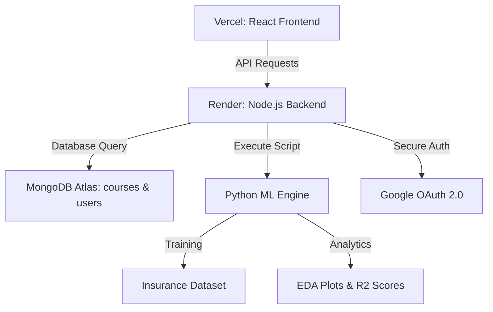

# Project Report: CCRS & Insurance ML Portal

**A Comprehensive Full-Stack Solution for Academic Management and Medical Cost Analytics.**

This report summarizes the implementation of the **College Course Registration System (CCRS)** and the **Insurance Premium ML Model**, as per the provided technical requirements.

---

## Requirement Fulfillment (Image Mapping)

| Requirement Area | Detailed Implementation | Status |
| :--- | :--- | :--- |
| **Use Case: CCRS** | Implemented a React/Node dashboard managing the `courses` collection with fields: `course_id`, `course_name`, `credits`, `faculty`, and `semester`. | Complete |
| **Dataset: Insurance** | Integrated the **Kaggle Medical Cost Personal Dataset** for medical premium analysis. | Complete |
| **Advanced EDA Focus** | Developed Python visualizations for **Premium vs Age** and **Smoker vs Non-Smoker** comparisons. | Complete |
| **ML Task: Regression** | Built a dual-model regression engine to predict insurance premiums using **Linear Regression** and **Random Forest**. | Complete |

---

## Technical Architecture

---

## Phase-by-Phase Implementation

### 1. Database & Security
*   **MongoDB Schema**: Designed robust Mongoose models for `Course`, `Insurance`, and `User`.
*   **Google OAuth 2.0**: Implemented secure login with JWT (JSON Web Token) session persistence.
*   **Validation**: Enforced strict validation limits (e.g., BMI: 10-100, Age: 0-120) to ensure data integrity.

### 2. Machine Learning Engine (Python)
*   **Preprocessing**: Automated handling of categorical data (Sex, Smoker status, Region) using one-hot encoding.
*   **EDA Module**: Custom script generates a high-resolution 4-panel analysis plot (`insurance_eda_plots.png`).
*   **Regression Analysis**:
    *   **Linear Regression**: For identifying clear linear trends in aging.
    *   **Random Forest**: For capturing complex interactions between smoking and obesity.

### 3. User Experience (Deep Space Theme)
*   **Glassmorphism**: A state-of-the-art UI using blurred backdrops, vibrant gradients, and micro-animations (Tailwind CSS v4).
*   **Dynamic UI**: 
    *   **Grid vs List Toggle**: High-density data management.
    *   **Smart Filtering**: One-click segmentation for Smokers/Non-Smokers.

---

## Deployment Summary

### Frontend (Vercel)
*   **Configuration**: SPA rewrite handling via `vercel.json`.
*   **Optimization**: Vite-based production build for sub-second load times.

### Backend (Render)
*   **Hybrid Build**: Custom build script that installs both Node dependencies (`npm`) and Python scientific libraries (`pip`).
*   **CORS Protection**: Secure origin-matching to allow only the Vercel frontend.

---
**Author**: Shreekant Lohagale  
**Project Date**: March 31, 2026  
*Submitted for final deployment and presentation.*
